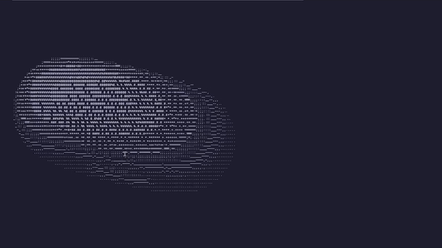

# donutcpp

A simple linux C++ project that aims to draw a spinning donut on the screen. Took [this post](https://www.a1k0n.net/2011/07/20/donut-math.html) as inspiration.  

The project contains a simple core Renderer and a few utility structs and functions. All the calculations are done on the CPU.



# requirements to run

 - A linux operating system
 - A terminal that supports ANSI escape codes (specifically \033[y;xH one)

# build requirements

 - CMake
 - A build system (make, ninja, etc.)
 - A C++ compiler (clang++, g++ etc.)
 - git

# build steps

make a build directory, run cmake inside it (substitute `Ninja` with something else if you want):

```
mkdir build
cd build
cmake -G Ninja ..
```

run your build system:

```
ninja
```

run the project:

```
./donutcpp
```

# testing steps

Build the project, run ctest:

```
ctest --output-on-failure
```

Testing is done with [doctest framework](https://github.com/doctest/doctest)

# configuration

It is not much, but you can change some configuration in `src/app/config.h` to tweak some things. Obviously recompile the project to apply. Here is the rundown for some of the settings:

 - `kTargetFps` - FPS that the application will try to achieve
 - `kSceneLiveTimeSeconds` - Application will end in this amount of seconds (if target FPS is not achieved, then time might be actually longer than this amount)
 - `kDonutMajor/MinorR` - major and minor radiuses of the torus
 - `kLightLevels` - a gradient of light. You can change it if you want more/less light levels.
 - `kLightPoint` - a light source position

# afterword

This project was mostly used so I can learn about quaternions and CMake. It was a fun project actually, kinda liked writing this renderer system. After using qmake for a long time cmake was surprisingly much better. No weird .pro/.pri file bullshit. Quaternions are actually super simple to use, it turns out. Thought I would struggle with them, but the simple implementation of something that rotates a point along the axis takes a few lines of code. I would encourage everyone doing something like that as a fun recreational programming challenge
